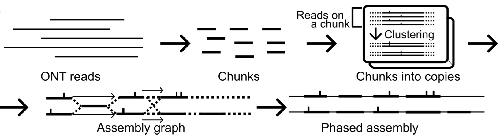

# JKT -- Targeted Diploid Genome Assembler <!-- omit in toc -->

## Getting Started <!-- omit in toc -->

```bash
# Make sure you have installed Rust >= 1.72.0-nightly & minimap2 >= 2.23
cargo --version
minimap2 --verion

# Install JTK
git clone https://github.com/ban-m/jtk.git
cd jtk
cargo build --release
./target/release/jtk --help

# Run JTK on a test ONT ultra-long read dataset
wget https://mlab.cb.k.u-tokyo.ac.jp/~ban-m/jtk/COX_PGF.fastq.gz
gunzip COX_PGF.fastq.gz
wget https://mlab.cb.k.u-tokyo.ac.jp/~ban-m/jtk/COX_PGF.toml
./target/release/jtk pipeline -p COX_PGF.toml 2> test.log
```

See the [Installation](#installation) section and [How to run JTK](#how-to-run-jtk) section for more details.

## Table of Contents <!-- omit in toc -->

- [Introduction](#introduction)
  - [Features (for general users)](#features-for-general-users)
  - [Algorithmic Features (for developers)](#algorithmic-features-for-developers)
- [Installation](#installation)
  - [Requirements](#requirements)
  - [Step-by-step Instruction](#step-by-step-instruction)
- [The Command: `jtk`](#the-command-jtk)
- [How to Run JTK](#how-to-run-jtk)
  - [Input](#input)
  - [Step-by-step Usage](#step-by-step-usage)
  - [Output Files](#output-files)
  - [Running JTK on a Test Data Set](#running-jtk-on-a-test-data-set)
- [How to Tune JTK](#how-to-tune-jtk)
- [Limitation](#limitation)
- [Contact](#contact)
- [Citation](#citation)
- [TODO for this README](#todo-for-this-readme)

## Introduction

JTK is a targeted diploid genome assembler aimed for **haplotype-resolved sequence reconstruction of medically important, difficult-to-assemble regions** such as HLA and LILR+KIR regions in a human genome.
JTK accurately assembles a pair of two (near-)complete haplotype sequences of a specified genomic region *de novo* typically from noisy **ONT ultra-long reads** (and optionally from any other types of long read datasets).


[adapted from Masutani et al., Bioinformatics, 2023]

### Features (for general users)

- The most promising input for JTK is **ONT's ultra-long reads** of >100 kbp with a coverage of >60x.
  - Technically, however, JTK accepts any type of long read sequencing data as input.
- JTK incorporates sophisticated probabilistic models and algorithms to accurately distinguish two haplotypes and multiple copies of repetitive elements from noisy ONT reads.
- Given a dataset collected from a **single sequencing technology** with a sufficient amount of coverage (i.e. 60x ONT UL reads), JTK achieves a (near-)complete reconstruction of both haplotypes.
  - For example, for two human samples (HG002 and a Japanese sample), JTK successfully assembled the two complete haplotypes of the histocompatibility complex (MHC) region and the leukocyte receptor complex (LRC) region from 60x ONT reads.
  - The resulting contigs have an ~99.9% sequence accuracy and a better contiguity than assemblies from high-coverage HiFi + Hi-C datasets.


### Algorithmic Features (for developers)

- The novel and fundamental approach of JTK is ***chunk*-based assembly**, where a chunk is a random kilobase-scale sequence (2kbp by default) representing multiple similar sequence segments in a given read dataset.
  -  That is, multiple reads originated from homologous sequences and paralogous copies of a repeat are represented by a single chunk at the beginning of the JTK assembly process. Each chuck is afterwards decomposed into each haplotype and each paralogous copy for the final, phased assembly.
  - By using chunks as building blocks of the assembly graph in this way, JTK accurately captures both SNVs and SVs in the underlying genome.
- We also developed a novel sequence phasing algorithm for the chunk decomposition step.
  - For each chunk, JTK identifies variants among all possible SNVs by checking if the variant increases the total likelihood of reads mapped to that chunk.
  - JTK then clusters the reads of the chunk into each haplotype/repeat copy based on the identified variants.
  - The SNV/non-SNV information computed here is also used for determining the final consensus sequences of contigs.
- Specifically, JTK runs in the following steps:
  1. Randomly samples chunk sequences from the given long reads,
  2. Aligns reads to the chunk sequences,
  3. Builds a graph from the adjacency information of chunks within each read,
  4. Phases variants found on individual chunks,
  5. Resolves the graph of chunks using reads spanning the variants, and
  6. Produces consensus contig sequences of two haplotypes.


## Installation

### Requirements

- [minimap2](https://github.com/lh3/minimap2) with version >= 2.23.
- [Rust](https://www.rust-lang.org/) with version >= 1.72.0 **nightly**.

### Step-by-step Instruction

1. First, check the version of the Rust language and minimap2 and update them if necessary.

    ```
    cargo --version
    ```

    If the version of Rust is smaller than 1.72.0-nightly, run `$ rustup update` to update Rust.

    ```
    minimap2 --verion
    ```

    If the version of minimap2 is smaller than 2.23 or minimap2 is not installed, install a newer version of minimap2 from [its GitHub repository](https://github.com/lh3/minimap2).

2. Then, compile JTK.

    ```
    git clone https://github.com/ban-m/jtk.git
    cd jtk
    cargo build --release
    ./target/release/jtk --version
    ```

    `./target/release/jtk` is the resulting binary executable of JTK.

3. [Optional] Lastly, move the executable, `./target/release/jtk`, to any location included in the `$PATH` variable.


## The Command: `jtk`

JTK has many subcommands corresponding to each specific step, but the following command does everything and is sufficient for most cases:

```
jtk pipeline -p <config-toml-file>
```

How to write the [TOML-formatted](https://toml.io/en/) config file, `<config-toml-file>`, is described in detail in the sections below: [How to run JTK](#how-to-run-jtk) and [How to tune JTK](#how-to-tune-jtk).

The full description of all the subcommands of JTK can be viewed with `$ jtk --help`:

```
USAGE:
    jtk [SUBCOMMAND]

OPTIONS:
    -h, --help       Print help information
    -V, --version    Print version information

SUBCOMMANDS:
    assemble                 Assemble reads.
    correct_clustering       Correct local clustering by EM algorithm.
    correct_deletion         Correct deletions of chunks inside the reads.
    encode                   Encode reads by alignments (Internally invoke `minimap2` tools).
    encode_densely           Encoding homologoud diplotig in densely.
    entry                    Entry point. It encodes a fasta file into JSON file.
    estimate_multiplicity    Determine multiplicities of chunks.
    extract                  Extract all the information in the packed file into one tsv
    help                     Print this message or the help of the given subcommand(s)
    mask_repeats             Mask Repeat(i.e., frequent k-mer)
    partition_local          Clustering reads. (Local)
    pick_components          Take top n largest components, discarding the rest and empty reads.
    pipeline                 Run pipeline based on the given TOML file.
    polish                   Polish contigs.
    polish_encoding          Remove nodes from reads.
    purge_diverged           Purge diverged clusters
    select_chunks            Pick subsequence from raw reads.
    squish                   Squish erroneous clusters
    stats                    Write stats to the specified file.
```


## How to Run JTK

### Input

The input data and corresponding Bash variables used in this section are as follows:

| Input Data | Bash variable name in this README |
|:-|:-|
| FASTA file of reads<br>(Here we assume 60x ONT ultra-long reads) | `$READS` |
| FASTA file of reference genome sequences<br>(e.g. `chm13v2.0.fa` of [T2T-CHM13](https://github.com/marbl/CHM13)) | `$REFERENCE` |
| Chromosome range of the target genomic region<br>(e.g. `chr1:10000000-15000000`) | `$REGION` |
| Config file for JTK<br>(Template is provided as described below) | `$CONFIG` |
| Number of threads | `$THREADS` |

NOTE:

- The reference sequences, `$REFERENCE`, are used only for extracting reads derived from the target genomic region, `$REGION`, and not for assembly itself.
- The target region, `$REGION`, should be smaller than 10Mbp and should not start/end within a segmental duplication region.


### Step-by-step Usage

1. First of all, you need to extract reads originated from the target region, which will be the input reads for JTK.

    - This can be done by mapping all the reads to the reference genome with `minimap2` and by using `samtools` with the specified chromosome range of the target genomic region:

    ```bash
    minimap2 -x map-ont -t $THREADS --secondary=no -a $REFERENCE $READS |
        samtools sort -@$THREADS -OBAM > aln.bam
    samtools index aln.bam
    samtools view -OBAM aln.bam $REGION |
        samtools fasta > reads.fasta
    ```

    - Here the resulting file, `reads.fasta`, will be the input file of ONT reads for JTK, i.e. `$READS`.

2. Then, create a config file for JTK.

    - There is a file named `example.toml` in the root of this GitHub repository, which is a template for the config file. Users are assumed to copy and modify this file to create their own config file, `$CONFIG`. The contents of `example.toml` are as follows:

    ```
    # example.toml

    ### The input file. Fasta and FASTQ is supported. Compressed files are not supported.
    input_file = "input.fa"
    ### The sequencing platform. ONT, CCS, or CLR.
    read_type = "ONT"
    ### The size of the target region, should be <10M. It is OK to use SI suffix, such as M or K.
    region_size = "5M"

    ### Output directory
    out_dir = "./"
    ### Output prefix. The final assembly would be `out_dir/prefix.gfa`.
    prefix = "temp"

    ...
    ```

    - In many cases, at least `input_file` and `region_size` will likely need to be modified.
      - The value of `input_file` must be the same as `$READS` prepared in the previous step.
      - The value of `region_size` must be calculated from the value of `$REGION` (i.e. end position minus start position).
    - Other options and parameters are explained in detail in the next section: [How to Tune JTK](#how-to-tune-jtk).
    - `sed` is useful for automatically generating a config file. For example, the following command specifies the name of the input file as `$READS`.

    ```bash
    cat example.toml |
        sed -e "/^input_file/c input_file = \""$READS"\"" > $CONFIG
    ```

    - Specifying absolute paths is recommended for the input read file and the output directory.

3. Finally, run JTK with the config file.

    ```bash
    jtk pipeline -p $CONFIG
    ```

    - This creates several JSON files and GFA files of assmbly graphs as described in detail below.
    - JTK creates temporary files at the *current directory*. Please execute it at the location where you have a write permission.


### Output Files

- `out.gfa`
  - The main output file of the assembled contigs in GFA format.

Additionally, JTK outputs the following files that are useful for downstream analyses:

- `<prefix>.sam` (`prefix` is defined in the config file)
  - Alignments between reads and the assembly.
- `<prefix>.coverage.tsv`
  - Coverage trace on the assembly.


### Running JTK on a Test Data Set

```bash
# Check if the version of minimap2 is greater than 2.23
minimap2 --version
# The version of JTK should be greater than 0.1
jtk --version
# Download the test input ONT reads (only of the HLA region of ~5Mbp)
wget https://mlab.cb.k.u-tokyo.ac.jp/~ban-m/jtk/COX_PGF.fastq.gz
gunzip COX_PGF.fastq.gz
# Download the config file prepared for the test ONT dataset
wget https://mlab.cb.k.u-tokyo.ac.jp/~ban-m/jtk/COX_PGF.toml
# Run JTK with the test dataset and its associated config file
jtk pipeline -p COX_PGF.toml 2> test.log
```

After running the commands above, there should exist `./cox_pgf/temp.gfa`, the resulting assembly graph file containing consensus contig sequences.

## How to Tune JTK

The config file (whose template is `example.toml`) offers several tunable parameters that influences the final assembly result:

- `purge_copy_num`: JTK discards every chunk whose estimated multiplicity in the underlying genome is greater than this value. Therefore, increasing this value could improve the assembly when the graph is fragmented or when the coverage of edges in the GFA (such as `cv:i:12`) is small. However, accurately clustering a chunk whose multiplicity is, say, 12 is quite challenging, and so increasing this value too much can worsen the assembly. The default value, 8, is typically the sweet spot of this trade-off.
- `min_span`: Any repeat in the assembly graph is resolved if the repeat is spanned by at least this number of reads. This value is related to how aggressively JTK resolves repeats (smaller is more aggressive).

The following parameter also has an impact on the assembly result, but it is not recommended to "tune" it:

- `seed`: Seed value for a random number generater.

## Limitation

- Do not specify a region larger than 10 Mbp long. It has not been tested.

## Contact

Bansho Masutani banmasutani@gmail.com

## Citation

Masutani et al., *Bioinformatics*, 2023

## TODO for this README

- Clarify Rust version requirement (nightly or stable?)
- Incorporate minimap2 into this repository？
- Add more examples
